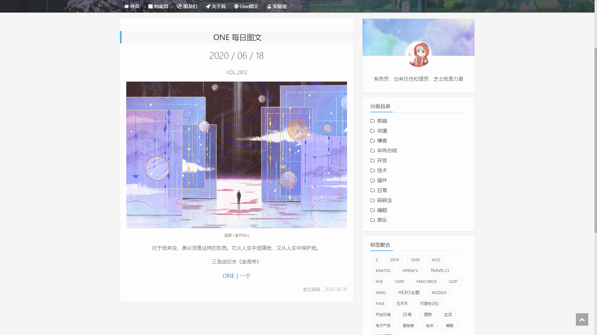

# OneToday

CloudFlare Workder 代理 ONE 一个官网(移动端)接口，获取每日图文 🏖。
演示地址：https://vensing.com/one/

## 使用方法

**CloudFlare Worker** 

新建一个 Worker，将 OneTodayWorker.js 中的内容粘贴至新建 Worker 页面左侧的脚本区；

**Web 端配置**

需先引入  jQuery ，然后在相关的 web 页面上引入 OneTodayWeb.js。注意将 url 和 jQuery 选择器配置成你自己的 Worker 地址和要添加每日一图的 DOM 节点。

**效果图**

